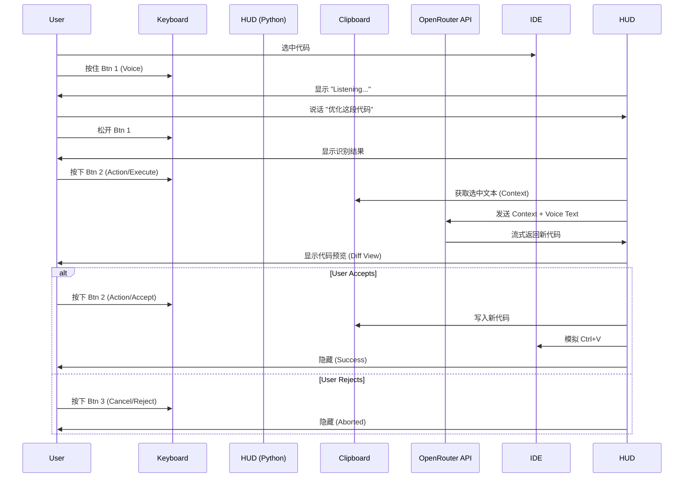

# Product Requirement Document: Vibecoder HUD (v1.0)

## 1. 项目概述 (Overview)

**Vibecoder HUD** 是一个专为“心流编程 (Vibecoding)”设计的桌面辅助系统。它通过一个定制的 6 键外设键盘触发，在桌面上唤起一个极简、无边框的抬头显示器 (HUD)。
该系统利用 **OpenRouter API**（聚合 Gemini/Claude/OpenAI 等模型）处理语音指令和代码逻辑，通过模拟剪贴板和键盘操作，实现与任意 IDE（IntelliJ IDEA, VS Code 等）的无缝集成。

## 2. 核心体验目标 (Core UX Goals)

* **沉浸感 (Vibe):** 界面采用极客风、半透明、无边框设计，模拟钢铁侠 JARVIS 或游戏 HUD 的视觉效果。
* **零插件 (Plugin-free):** 不依赖特定 IDE 插件，通过 OS 级别的输入/剪贴板接管，通用性 100%。
* **键盘优先:** 所有操作（触发、确认、拒绝、执行）手不离键盘即可完成。

## 3. 硬件接口定义 (Hardware Interface)

系统后端通过监听全局快捷键来响应物理键盘的操作。

**物理按键映射表:**

| 物理按键 | 映射键值 | 内部名称 | 功能描述 |
| --- | --- | --- | --- |
| **Btn 1** | `Alt+Shift+F2` | `KEY_VOICE` | **录音键**: 按住录音，松开结束录音。HUD 应该显示识别到的结果。 |
| **Btn 2** | `Alt+Shift+F3` | `KEY_ACTION` | **确认/执行键**:  1. 录音结束并获得识别结果后：开始执行语音命令。 2. AI 生成代码后：**同意**并替换代码。 |
| **Btn 3** | `Alt+Shift+F1` | `KEY_CANCEL` | **取消/打断键**:  1. 任何时候：打断当前步骤。 2. AI 生成代码后：**不同意**替换代码。 |
| **Btn 4** | `Alt+Shift+F5` | `KEY_NEW` | **重置键**: 开启新的聊天（重置上下文）。 |
| **Btn 5** | `Tab` | `KEY_TAB` | **Tab 键**: 透传 Tab 键，保留 IDE 原有功能。 |
| **Btn 6** | `Alt+Shift+F6` | `KEY_YOLO` | **YOLO 模式**: 执行 Shell 命令模式。 |

---

## 4. 功能详细说明 (Functional Requirements)

### 4.1. 语音输入 (Voice Input)

* **触发**: 用户按下 `KEY_VOICE` (Btn 1)。
* **UI 响应**: HUD 显现，状态指示器变为红色 `[REC]`，显示音频波形动画（可选）。
* **逻辑**: 调用本地音频库 (`sounddevice`) 录制。
* **处理**: 松开按键结束录音，调用 OpenRouter (或 Deepgram/Whisper) 接口转文字。
* **输出**: 转录文本自动填入 HUD 输入框。

### 4.2. 智能编程模式 (Coding Mode)

* **上下文获取**:
1. 用户在 IDE 选中代码。
2. 按下 `KEY_ACTION` (Btn 2) 确认执行。
3. 系统自动执行 `Ctrl+C` 获取选中文本作为 Context。

* **AI 请求**:
* 构造 Prompt: `Context (Clipboard) + Instruction (Voice/Text)`.
* API 调用: OpenRouter Chat Completion (Stream 模式)。

* **UI 展示 (Diff View)**:
* HUD 显示 Markdown 渲染的代码块。
* 支持流式打字机效果 (Typewriter Effect)。

* **接纳 (Accept)**:
* 用户再次按下 `KEY_ACTION` (Btn 2)。
* 系统执行: 焦点切回 IDE -> `Ctrl+V` -> 隐藏 HUD。

* **拒绝 (Reject)**:
* 用户按下 `KEY_CANCEL` (Btn 3)。
* 系统执行: 隐藏 HUD，清空当前生成结果。

### 4.3. YOLO 模式 (Shell Execution)

* **触发**: 用户按下 `KEY_YOLO` (Btn 6)。
* **逻辑**:
1. 系统添加 System Prompt: *"你是一个终端助手，只返回 Shell 命令，不要解释，不要 Markdown 格式。Windows PowerShell 环境。"*.
2. 获取 Context（可选）和指令。
3. AI 返回命令（例如 `git commit -am "fix bug"`）。

* **UI 展示**:
* HUD 显示: `> git commit -am "fix bug"`
* 状态: `EXECUTING...`

* **执行**:
* Python `subprocess` 调用命令。
* 捕获 `stdout` 和 `stderr` 实时回显在 HUD 中。

---

## 5. UI/UX 规范 (Visual Specs)

### 5.1. 窗口属性

* **类型**: 桌面覆盖层 (Overlay/Toast)。
* **位置**: 屏幕右上角 或 正中央（可配置）。
* **样式**:
* 背景: `#1e1e1e` (深灰)，透明度 90%。
* 边框: 无边框，圆角 `8px`。
* 阴影: 强阴影，营造悬浮感。

### 5.2. 状态指示色 (Status Indicators)

* **IDLE (待机)**: 隐藏 或 极小的呼吸灯 (灰色)。
* **LISTENING (听)**: 🔴 Red
* **THINKING (想)**: 🔵 Cyan (呼吸效果)
* **REVIEW (待确认)**: 🟡 Yellow
* **SUCCESS (完成)**: 🟢 Green
* **YOLO (执行中)**: 🟣 Magenta

---

## 6. 技术栈 (Tech Stack)

### 6.1. 客户端 (Python)

* **GUI Framework**: `PyQt6` (推荐) 或 `Pyside6`。因其对高分屏和透明窗口支持最好。
* **Input Handling**: `keyboard` (全局热键), `pyperclip` (剪贴板).
* **Audio**: `sounddevice` (录音), `numpy` (波形处理).
* **HTTP Client**: `openai` (Python SDK，兼容 OpenRouter).

### 6.2. API 配置 (OpenRouter)

由于 OpenRouter 兼容 OpenAI SDK，配置非常简单：

* **Base URL**: `https://openrouter.ai/api/v1`
* **API Key**: `sk-or-xxxx`
* **推荐模型**:
* *Coding*: `google/gemini-2.5-flash`。
* *Yolo/Fast*: `x-ai/grok-code-fast-1`。
* *Transcription*: `google/gemini-2.5-flash`。

## 7. 数据流示意 (Data Flow)

---

## 8. 开发路线图 (Roadmap)

1. **Phase 1: 核心链路打通**
* 实现全局快捷键监听。
* 实现 `Ctrl+C` -> 获取文本 -> `Ctrl+V` 流程。
* 接入 OpenRouter 跑通 Hello World。

2. **Phase 2: HUD 界面开发**
* 使用 PyQt6 绘制无边框窗口。
* 实现文本流式显示。
* 添加状态颜色变化。

3. **Phase 3: 语音与 YOLO**
* 集成录音与 STT (Speech-to-Text)。
* 实现 `subprocess` 命令执行逻辑。

4. **Phase 4: 调优 (Vibing)**
* 调整动画速率。
* 配置 Config 文件（允许自定义 Prompt 模板）。